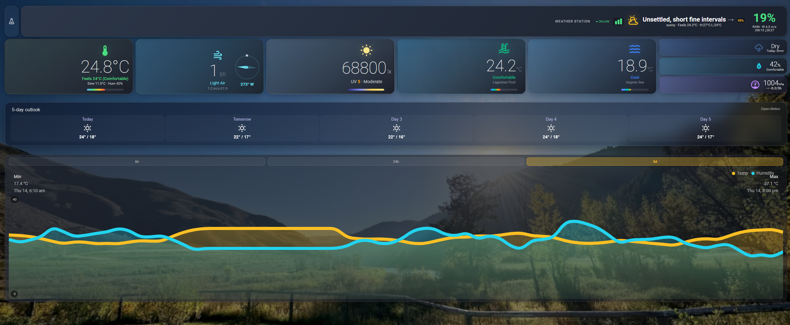
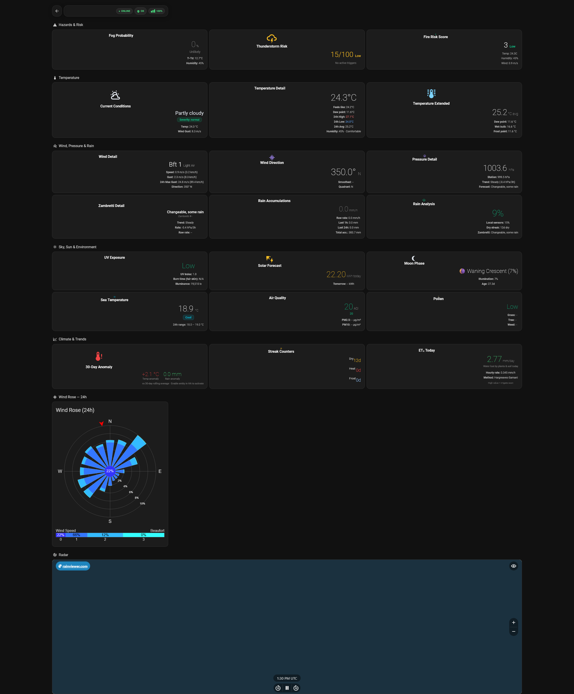

# Weather Station Core (`ws_core`)

[![HACS][hacs-badge]][hacs-url]
[![GitHub Release][release-badge]][release-url]
[![License][license-badge]][license-url]
[![Validate][validate-badge]][validate-url]

**Turn any personal weather station into a comprehensive, scientifically-grounded weather intelligence hub for Home Assistant.**

Weather Station Core reads raw sensor data from your existing weather station - Ecowitt, Davis, WeatherFlow, Shelly, or any HA-integrated PWS - and produces 95+ derived meteorological values through a guided config flow. No YAML required.

---

## Screenshots

| Weather view | Advanced view |
|---|---|
|  |  |

---

## What's New in 1.10

**Fixed sensor filtering** (1.10.0) - atmospheric pressure and other sensors were appearing in the wrong slot in the setup wizard due to over-restrictive device-class filtering. All numeric sensors now show in all pickers.

**Localised state labels** (1.10.0) - AQI level, fog probability, thunderstorm risk, and moon phase now use translation keys so HA renders them in the user's language. French translations included.

**Pollen detail** (1.10.0) - per-species grass/tree/weed level keys added alongside the existing overall pollen level.

**Battery voltage sensor** (1.9.1) - stations that report battery as a voltage sensor (e.g. GW3000A) are no longer rejected by the config flow.

**Vigicrues station picker** (1.9.0, France only) - the config flow now includes a dedicated step for choosing a hydrometric station. Up to 20 stations within 50 km are shown; pin a specific gauge or keep auto-detect.

**Restart-safe history** (1.7.1) - the 24h stats and daily accumulators (`rain_today`, `wind_run`, `chill_hours`, 24h temperature high/low/avg, wind gust max, rain last 1h/24h) now persist across restarts and upgrades instead of resetting.

See the [CHANGELOG](CHANGELOG.md) for full details.

---

## Features

- **Real Zambretti barometric forecaster** - Negretti & Zambra lookup table (Z-numbers 1-26), climate-region-aware wind corrections, seasonal adjustment
- **Wet-bulb temperature** (Stull 2011, ±0.3 °C) and **frost point** (Buck 1981 ice constants)
- **Comfort & heat-stress indices** - Heat Index (NWS Rothfusz), Wind Chill (WMO 2001), Humidex (Environment Canada), Davis THW/THSW; plus VPD, absolute humidity, Delta-T spray window, wind run, chill hours, and solar-derived clearness index & cloud cover
- **Nowcast correction (0-3 h)** - local station readings blend into the first three hourly forecast slots with tapering weights (70 % local at h+0, 40 % at h+1, 10 % at h+2, pure NWP from h+3); fields: temperature, humidity, dew point, wind speed
- **Adaptive rain probability** - `sensor.ws_rain_probability_combined` uses Brier-score-derived blend weights that learn over a rolling 90-day window which source (local heuristic vs NWP) has historically been more accurate; falls back to fixed day/night weights until enough data accumulates
- **Forecast agreement sensor** - `sensor.ws_forecast_agreement` compares Zambretti's Z-number-implied rain likelihood against the NWP provider's `precip_prob`; states: `aligned` (< 20 pp delta), `diverging` (20-40 pp), `conflict` (> 40 pp) - useful for surfacing low-confidence forecasts in dashboards or automations
- **Kalman-filtered rain rate** for de-noised precipitation readings
- **36-condition weather classifier** with severity levels and MDI icons
- **Fog probability** - dew-point depression model with wind, night, and rain corrections
- **Thunderstorm risk index** - surface-based heuristic proxy (T-Td gap, pressure fall rate, wind acceleration)
- **Streak counters** - consecutive dry days, heat days, and frost days
- **Full Canadian FWI system** - FFMC, DMC, DC, ISI, BUI, FWI, DSR with persistent daily moisture memory (Van Wagner 1987)
- **Pluggable forecast provider** - choose Open-Meteo (default, free), Met.no (free), NWS/NOAA (free, US only), OpenWeatherMap (API key), or Pirate Weather (API key) from the Configure menu; swappable without reinstalling
- **Air Quality Index** via Open-Meteo (free, no API key) - PM2.5, PM10, NO₂, ozone exposed as standalone sensors
- **Pollen levels** (grass, tree, weed) via Open-Meteo (free, no API key)
- **Moon phase & illumination** - calculated astronomically, no API key required
- **Solar PV forecast** (today + tomorrow kWh) via forecast.solar (free, no API key)
- **Penman-Monteith ET₀** - activates automatically when a solar radiation sensor is mapped
- **Sea surface temperature** via Open-Meteo Marine API (free, no API key)
- **Weather Underground upload** with credential validation at setup
- **30-day rolling climatology** - local temperature and rain anomalies built from station history
- **Sensor drift & consistency monitoring** - 72h regression drift detection, cross-sensor physics checks
- **Full translations** - all 95+ entity names are translatable; French ships out of the box, more community translations welcome
- **Full options flow** - every setting reconfigurable post-install via the Configure button, no reinstall needed

---

## Requirements

A personal weather station integrated into Home Assistant providing **at minimum**:

| Measurement | Example entities |
|---|---|
| Temperature | `sensor.gw2000a_outdoor_temperature` |
| Relative humidity | `sensor.gw2000a_outdoor_humidity` |
| Atmospheric pressure | `sensor.gw2000a_absolute_pressure` |
| Wind speed | `sensor.gw2000a_wind_speed` |
| Wind gust | `sensor.gw2000a_wind_gust` |
| Wind direction (°) | `sensor.gw2000a_wind_direction` |
| Cumulative rainfall | `sensor.gw2000a_rain_total` |

**Optional** (improves derived metrics): illuminance (lux), UV index, dew point, battery level, solar radiation (W/m²).

**Home Assistant**: 2026.3+ · **Python**: 3.12+

---

## Installation

### Via HACS (recommended)

1. Open HACS → Integrations → ⋮ → Custom repositories
2. Add `https://github.com/kmich/ha_ws_core` (category: Integration)
3. Search for "Weather Station Core" and install
4. Restart Home Assistant

### Manual

1. Copy `custom_components/ws_core` to your HA `custom_components/` directory
2. Restart Home Assistant

---

## Configuration

Settings → Devices & Services → Add Integration → "Weather Station Core"

The setup wizard walks you through:

| Step | What it does |
|---|---|
| 1. Name & prefix | Station name and entity ID prefix (e.g. `ws` → `sensor.ws_temperature`) |
| 2. Required sensors | Map your 7 mandatory sensor entities |
| 3. Optional sensors | Map illuminance, UV, dew point, battery, solar radiation (leave blank to skip) |
| 4. Location & climate | Hemisphere, climate region, elevation (auto-detected from HA) |
| 5. Display units | Temperature, wind, rain, pressure unit preferences |
| 6. Forecast | Enable/disable 7-day forecast, coordinates, **forecast provider** (Open-Meteo / Met.no / NWS/NOAA / OpenWeatherMap / Pirate Weather); API key sub-step appears automatically for providers that require one |
| 7. Features | Toggle feature groups: fire risk, fog, thunderstorm, sea temp, WU upload, air quality, pollen, moon, solar forecast, comfort indices, Meteo Vigilance, Vigicrues, station diagnostics, FWI components, advanced sensors, precipitation nowcast |
| 7a-7c | Per-feature sub-steps for Weather Underground (credentials), Solar Forecast (panel config), Sea Temp (lat/lon override) |
| 8. Alerts | Wind/rain/freeze thresholds |

Every step (except the first) includes a "Go back" toggle to return to the previous step. Zambretti forecasting and the weather condition classifier are always enabled (core functionality).

All settings can be changed later via **Configure** (Settings → Devices & Services → Weather Station Core → Configure). The options flow mirrors the full config flow.

---

## Sensors Created

### Core Measurements (always enabled)

| Entity | Unit | Device Class | Description |
|---|---|---|---|
| `sensor.ws_temperature` | °C | temperature | Normalized temperature |
| `sensor.ws_humidity` | % | humidity | Normalized relative humidity |
| `sensor.ws_station_pressure` | hPa | pressure | Station-level pressure |
| `sensor.ws_sea_level_pressure` | hPa | pressure | Mean sea-level pressure (MSLP) |
| `sensor.ws_wind_speed` | m/s | wind_speed | Sustained wind speed |
| `sensor.ws_wind_gust` | m/s | wind_speed | Wind gust speed |
| `sensor.ws_wind_direction` | ° | wind_direction | Wind direction |
| `sensor.ws_rain_total` | mm | precipitation | Cumulative rainfall (TOTAL_INCREASING) |
| `sensor.ws_rain_rate` | mm/h | precipitation_intensity | Kalman-filtered rain rate |
| `sensor.ws_dew_point` | °C | temperature | Dew point (Magnus formula) |
| `sensor.ws_illuminance` | lx | illuminance | Solar illuminance |
| `sensor.ws_uv_index` | - | - | UV index |

### Advanced Meteorological (always enabled)

| Entity | Unit | Description |
|---|---|---|
| `sensor.ws_feels_like` | °C | Apparent temperature (BOM/Steadman formula) |
| `sensor.ws_wet_bulb` | °C | Wet-bulb temperature (Stull 2011) |
| `sensor.ws_frost_point` | °C | Frost point (ice constants below 0 °C) |
| `sensor.ws_zambretti_forecast` | - | Zambretti barometric forecast text |
| `sensor.ws_zambretti_number` | - | Z-number (1-26) for automations |
| `sensor.ws_wind_beaufort` | - | Beaufort scale number |
| `sensor.ws_wind_quadrant` | - | 4-point compass quadrant (N/E/S/W) |
| `sensor.ws_current_condition` | - | 36-condition weather classifier |
| `sensor.ws_rain_probability` | % | Local sensor-based rain index |
| `sensor.ws_rain_probability_combined` | % | Blended local + NWP forecast (Brier-score adaptive weights) |
| `sensor.ws_forecast_agreement` | - | Zambretti vs NWP agreement: `aligned` / `diverging` / `conflict` |
| `sensor.ws_pressure_trend` | - | Rising/Falling/Steady with rate (WMO No. 306) |
| `sensor.ws_rain_last_1h` | mm | Rolling 1-hour rain accumulation |
| `sensor.ws_rain_last_24h` | mm | Rolling 24-hour rain accumulation |
| `sensor.ws_rain_today` | mm | Today's accumulated rainfall (resets at local midnight) |

### 24h Rolling Statistics

| Entity | Description |
|---|---|
| `sensor.ws_temperature_high_24h` | 24-hour high temperature |
| `sensor.ws_temperature_low_24h` | 24-hour low temperature |
| `sensor.ws_wind_gust_max_24h` | 24-hour maximum gust |

### Streak Counters (always enabled)

| Entity | Unit | Description |
|---|---|---|
| `sensor.ws_dry_streak` | days | Consecutive days without measurable rain |
| `sensor.ws_heat_streak` | days | Consecutive days above heat threshold |
| `sensor.ws_frost_streak` | days | Consecutive days below 0 °C |

### ET₀ Reference Evapotranspiration (activates when forecast lat/lon is set)

| Entity | Unit | Description |
|---|---|---|
| `sensor.ws_et0_daily` | mm | Daily ET₀ - Hargreaves-Samani 1985 (±15-20%) |
| `sensor.ws_et0_pm_daily` | mm | Daily ET₀ - Penman-Monteith (activates when solar radiation sensor is mapped; ±5-10%) |

### Optional: Fire Risk & Canadian FWI (`enable_fire_risk_score`)

| Entity | Scale | Description |
|---|---|---|
| `sensor.ws_fire_risk_score` | 1-10 | Fire danger level derived from FWI (backward-compatible scale) |
| `sensor.ws_fwi_ffmc` | 0-101 | Fine Fuel Moisture Code - fine dead fuels / litter |
| `sensor.ws_fwi_dmc` | ≥ 0 | Duff Moisture Code - mid-depth organic layer |
| `sensor.ws_fwi_dc` | ≥ 0 | Drought Code - deep compact organic layer |
| `sensor.ws_fwi_isi` | ≥ 0 | Initial Spread Index - expected rate of fire spread |
| `sensor.ws_fwi_bui` | ≥ 0 | Buildup Index - total available fuel |
| `sensor.ws_fwi` | ≥ 0 | Fire Weather Index - intensity of a spreading fire |
| `sensor.ws_fwi_dsr` | ≥ 0 | Daily Severity Rating - difficulty of fire control |

The seven sub-index sensors are disabled by default; enable them individually on the device page.

### Optional: Fog Probability (`enable_fog`)

| Entity | Unit | Description |
|---|---|---|
| `sensor.ws_fog_probability` | % | Dew-point depression fog model |

### Optional: Thunderstorm Risk (`enable_thunderstorm_risk`)

| Entity | Scale | Description |
|---|---|---|
| `sensor.ws_thunderstorm_risk` | 0-100 | Surface-based thunderstorm risk index |

### Optional: Sea Surface Temperature (`enable_sea_temp`)

| Entity | Unit | Description |
|---|---|---|
| `sensor.ws_sea_surface_temperature` | °C | SST via Open-Meteo Marine API |

### Optional: Weather Underground Upload (`enable_wunderground`)

| Entity | Description |
|---|---|
| `sensor.ws_wu_upload_status` | Upload state: `ok`, `error_http`, `error_network`, `error`, `disabled`; `last_upload` attribute holds the timestamp |

### Optional: Air Quality (`enable_air_quality`)

| Entity | Unit | Description |
|---|---|---|
| `sensor.ws_air_quality_index` | AQI | US EPA AQI from Open-Meteo (PM2.5-based) |
| `sensor.ws_no2` | µg/m³ | Nitrogen dioxide (diagnostic) |
| `sensor.ws_ozone` | µg/m³ | Ozone (diagnostic) |

### Optional: Pollen (`enable_pollen`)

| Entity | Description |
|---|---|
| `sensor.ws_pollen_level` | Highest of grass/tree/weed (None/Low/Medium/High/Very High) |
| `sensor.ws_pollen_grass` | Grass pollen IQLA index |
| `sensor.ws_pollen_tree` | Tree pollen IQLA index |
| `sensor.ws_pollen_weed` | Weed pollen IQLA index |

### Optional: Moon (`enable_moon`)

| Entity | Description |
|---|---|
| `sensor.ws_moon` | Human-readable phase name with illumination % |
| `sensor.ws_moon_illumination` | Illumination percentage |

### Optional: Solar PV Forecast (`enable_solar_forecast`)

| Entity | Unit | Description |
|---|---|---|
| `sensor.ws_solar_forecast_today` | kWh | Estimated PV generation today |
| `sensor.ws_solar_forecast_tomorrow` | kWh | Estimated PV generation tomorrow |

### Optional: Comfort Indices (`enable_comfort_indices`)

Disabled by default (opt-in). Enable via the **Comfort Indices** switch (`switch.ws_enable_comfort_indices`) on the device page, or via Configure -> Features. Once enabled, all 13 sensors appear immediately. THSW, clearness index, and cloud cover require an optional `solar_radiation` (W/m²) source to be mapped.

| Entity | Unit | Description |
|---|---|---|
| `sensor.ws_heat_index` | °C | NWS Heat Index (Rothfusz); active only when T ≥ 27 °C and RH ≥ 40 % |
| `sensor.ws_wind_chill` | °C | WMO/NWS Wind Chill (2001); active only when T ≤ 10 °C and wind > 1.34 m/s |
| `sensor.ws_humidex` | °C | Canadian Humidex (Environment Canada); active only when above ambient temperature |
| `sensor.ws_thw_index` | °C | Davis THW index - Heat Index with wind cooling |
| `sensor.ws_thsw_index` | °C | Davis THSW index - THW plus solar heating (needs solar radiation sensor) |
| `sensor.ws_vpd` | kPa | Vapour Pressure Deficit - greenhouse / irrigation control |
| `sensor.ws_absolute_humidity` | g/m³ | Mass of water vapour per m³ of air |
| `sensor.ws_delta_t` | °C | Dry-bulb minus wet-bulb; spray-application window. `spray_suitability` attribute: `ideal` (2-8 °C) / too low / too high |
| `sensor.ws_wind_run` | km | Daily accumulated wind travel; resets at local midnight |
| `sensor.ws_chill_hours_today` | h | Hours today at or below the chill base temperature (default 7.2 °C) |
| `sensor.ws_chill_hours_season` | h | Season-to-date chill hours; resets on configured date (default 1 July) |
| `sensor.ws_clearness_index` | - | Clearness index Kt = observed / clear-sky solar radiation (needs solar radiation sensor) |
| `sensor.ws_cloud_cover` | % | Approximate cloud cover derived from the clearness index |

### Optional: Meteo Vigilance (`enable_vigilance_meteo`)

France only. No API key required. Enable via the **Meteo Vigilance** feature switch. The integration auto-detects your department from your Home Assistant coordinates using BAN reverse geocoding.

| Entity | Description |
|---|---|
| `sensor.ws_vigilance` | Worst departmental alert colour: `vert` / `jaune` / `orange` / `rouge`. State attributes: `phenomena` (dict of phenomenon to colour), `department` (INSEE code), `fetched_at` |

### Optional: Vigicrues River Level (`enable_vigicrues`)

France only. No API key required. Enable via the **Vigicrues River Level** feature switch. The nearest gauging station is looked up once from your HA coordinates and cached.

| Entity | Unit | Description |
|---|---|---|
| `sensor.ws_river_level` | m | Real-time water height at the nearest station. State attributes: `station`, `river`, `station_code`, `observed_at` |

### Optional: Station Diagnostics (`enable_diagnostics`)

Opt-in. Enable via the **Station Diagnostics** switch or Configure -> Features. Off by default to keep the recorder database and entity pickers clean.

| Entity | Description |
|---|---|
| `sensor.ws_sensor_drift` | Per-sensor monotonic drift detection flags |
| `sensor.ws_sensor_consistency` | Cross-sensor physical consistency flags |
| `sensor.ws_sensor_quality_flags` | Aggregate sensor validation flags |
| `sensor.ws_forecast_skill` | Learned forecast skill score |
| `sensor.ws_forecast_agreement` | Agreement between internal heuristics and the external forecast |
| `sensor.ws_solar_lux_factor` | Learned lux -> W/m² conversion factor |
| `sensor.ws_climatology_30d` | Rolling 30-day climatology summary |

### Optional: FWI Components (`enable_fwi_components`)

Opt-in. The five intermediate codes of the Canadian Forest Fire Weather Index. **Requires Fire Risk enabled** to produce data (the composite Fire Weather Index and Daily Severity Rating come with Fire Risk itself).

| Entity | Description |
|---|---|
| `sensor.ws_fwi_ffmc` | Fine Fuel Moisture Code |
| `sensor.ws_fwi_dmc` | Duff Moisture Code |
| `sensor.ws_fwi_dc` | Drought Code |
| `sensor.ws_fwi_isi` | Initial Spread Index |
| `sensor.ws_fwi_bui` | Buildup Index |

### Optional: Advanced Sensors (`enable_advanced_sensors`)

Opt-in. Alternate/derived representations of data already exposed elsewhere - useful for automations.

| Entity | Description |
|---|---|
| `sensor.ws_zambretti_number` | Numeric form of the Zambretti forecast (for automations) |
| `sensor.ws_et0_hourly` | Hourly ET₀ rate (finer grain than the daily total) |
| `sensor.ws_wind_direction_smooth` | EMA-smoothed wind direction in degrees |

### Optional: Precipitation Nowcast (`enable_nowcast`)

Opt-in. Short-term rain timing from Open-Meteo's 15-minute precipitation buckets (free, no API key, independent of the chosen forecast provider). Refreshes every 15 minutes.

| Entity | Unit | Description |
|---|---|---|
| `sensor.ws_minutes_until_rain` | min | Minutes until rain is expected to start (unknown when none in window) |
| `sensor.ws_minutes_until_dry` | min | Minutes until rain is expected to stop (when raining) |
| `sensor.ws_rain_next_60min` | mm | Total precipitation expected in the next hour |
| `sensor.ws_nowcast_intensity` | - | none / light / moderate / heavy (peak rate in the next hour) |
| `binary_sensor.ws_rain_expected_1h` | - | On when measurable rain is expected within 60 minutes |

### Other Entities

| Entity | Type | Description |
|---|---|---|
| `weather.ws` | weather | Standard HA weather entity with daily forecast |
| `binary_sensor.ws_package_ok` | binary_sensor | True when all required sources are mapped and available |
| `select.ws_graph_range` | select | Dashboard graph time range (6h/24h/3d) |
| `switch.ws_enable_animations` | switch | Dashboard animation toggle |

### Configuration Entities (device page)

All configurable parameters are exposed as entities on the device page so you can adjust them directly without entering the config flow. Changes trigger a coordinator reload automatically.

**Number entities** (thresholds, calibration offsets, algorithm parameters):

| Entity | Unit | Description |
|---|---|---|
| `number.ws_thresh_wind_gust` | m/s | Wind gust alert threshold |
| `number.ws_thresh_rain_rate` | mm/h | Rain rate alert threshold |
| `number.ws_thresh_freeze` | °C | Freeze warning threshold |
| `number.ws_cal_temp` | °C | Temperature calibration offset |
| `number.ws_cal_humidity` | % | Humidity calibration offset |
| `number.ws_cal_pressure` | hPa | Pressure calibration offset |
| `number.ws_cal_wind` | m/s | Wind speed calibration offset |
| `number.ws_staleness_timeout` | s | Sensor staleness timeout |
| `number.ws_rain_filter_alpha` | - | Rain-rate Kalman filter smoothing coefficient |
| `number.ws_pressure_trend_window` | h | Pressure trend calculation window |

**Switch entities** (feature toggles):

| Entity | Description |
|---|---|
| `switch.ws_enable_display_sensors` | Display sensors (levels, trends, health) |
| `switch.ws_enable_fire_risk_score` | Fire risk score |
| `switch.ws_enable_fog` | Fog probability |
| `switch.ws_enable_thunderstorm_risk` | Thunderstorm risk index |
| `switch.ws_enable_sea_temp` | Sea surface temperature |
| `switch.ws_enable_wunderground` | Weather Underground upload |
| `switch.ws_enable_air_quality` | Air quality index |
| `switch.ws_enable_pollen` | Pollen levels |
| `switch.ws_enable_moon` | Moon phase & illumination |
| `switch.ws_enable_solar_forecast` | Solar PV forecast |
| `switch.ws_enable_comfort_indices` | Comfort & agrometeorological indices |

---

## Dashboards

Two dashboards are provided in `dashboards/`:

### Vanilla Dashboard (`weather_dashboard_vanilla.yaml`)

Uses **only native HA cards** - no HACS frontend dependencies. Works immediately after installation.

To install: copy the YAML → Dashboard → Edit → Raw Configuration Editor → paste → save.

### Enhanced Dashboard (`weather_dashboard.yaml`)

Rich visual dashboard requiring these HACS frontend cards:
- `custom:button-card`
- `custom:mini-graph-card`
- `custom:stack-in-card`
- `custom:config-template-card`
- `custom:windrose-card`
- `card-mod`
- `kiosk-mode`

---

## Scientific Documentation

Every derived metric is documented with its algorithm, source reference, valid input range, and known limitations.

---

### Dew Point - Magnus Formula (Alduchov & Eskridge 1996)

The dew point T_d is the temperature at which air becomes saturated if cooled at constant pressure and humidity. Derived by inverting the Magnus saturation vapour pressure formula.

```
γ(T, RH) = (a·T) / (b + T) + ln(RH / 100)
T_d = (b · γ) / (a − γ)

Over water (T ≥ 0 °C): a = 17.625, b = 243.04 °C   [Alduchov & Eskridge 1996]
Over ice  (T < 0 °C):  a = 22.587, b = 273.86 °C   [Buck 1981]
```

**Valid range:** −45 °C to +60 °C, 1-100% RH. **Max error:** < 0.1 °C within range.
**Reference:** Alduchov, O.A. & Eskridge, R.E. (1996). *J. Appl. Meteor.*, 35, 601-609.

---

### Frost Point - Magnus Formula with Ice Constants (Buck 1981)

The frost point is the temperature at which ice saturation occurs. Physically distinct from dew point only below 0 °C - above freezing the two are identical. Uses Buck's (1981) ice-phase saturation constants, which are more accurate over ice than the standard Tetens coefficients.

Same formula as dew point but always uses ice constants (a = 22.587, b = 273.86). Returns dew point above 0 °C, frost point below 0 °C.

**Reference:** Buck, A.L. (1981). *J. Appl. Meteor.*, 20, 1527-1532.

---

### Wet-Bulb Temperature - Stull (2011)

The wet-bulb temperature T_w is the lowest temperature air can reach by evaporative cooling at constant pressure. Critical for heat stress assessment (heat index, WBGT approximations) and precipitation phase determination.

```
T_w = T · atan(0.151977 · (RH + 8.313659)^0.5)
    + atan(T + RH)
    − atan(RH − 1.676331)
    + 0.00391838 · RH^1.5 · atan(0.023101 · RH)
    − 4.686035
```

**Valid range:** T −20 to +50 °C, RH 5-99%. **Max error:** ±0.3 °C.
**Reference:** Stull, R. (2011). Wet-Bulb Temperature from Relative Humidity and Air Temperature. *J. Appl. Meteor. Climatol.*, 50, 2267-2269.

---

### Sea-Level Pressure - Hypsometric Reduction (WMO No. 8)

Station pressure must be reduced to mean sea level to be comparable between stations at different elevations. Uses the hypsometric (barometric) equation with a simplified isothermal column assumption.

```
MSLP = P_station × exp(elevation_m / (T_K × R/g))
     = P_station × exp(elevation_m / (T_K × 29.263))

where R/g = 287.058 / 9.80665 ≈ 29.263 m·K / hPa
      T_K = temperature in Kelvin
```

**Accuracy:** ±0.3 hPa below 500 m, ±1 hPa at 2000 m.
**Limitation:** Uses instantaneous temperature. WMO recommends the 12-hour mean temperature for accuracy above 500 m during rapid temperature swings.
**Reference:** WMO No. 8 - Guide to Meteorological Instruments and Methods of Observation, Annex 3A.

---

### Apparent Temperature - Australian BOM / Steadman (1994)

The physiologically-equivalent temperature accounting for humidity (evaporative heat loss) and wind (convective heat loss). Unlike the NWS wind chill and heat index formulas - which have separate validity ranges and do not overlap - the Australian BOM formula applies continuously across all temperatures.

```
AT = T_a + 0.33 · e − 0.70 · ws − 4.0

where e = (RH / 100) × 6.105 × exp((17.27 · T) / (237.7 + T))   [vapour pressure, hPa]
      ws = wind speed at 10 m height [m/s]
```

**Reference:** Steadman, R.G. (1994). Norms of apparent temperature in Australia. *Aust. Met. Mag.*, 43, 1-16.

---

### Heat Index - NWS Rothfusz Regression (1990)

The US National Weather Service "apparent temperature" for hot, humid conditions. A multiple regression fit to Steadman's 1979 heat-stress tables.

```
HI = −42.379 + 2.04901523·T + 10.14333127·RH − 0.22475541·T·RH
     − 0.00683783·T² − 0.05481717·RH² + 0.00122874·T²·RH
     + 0.00085282·T·RH² − 0.00000199·T²·RH²       (T in °F)
```

**Valid range:** T ≥ 27 °C (80 °F) and RH ≥ 40 %. Outside this envelope the sensor reports nothing (the formula is not defined and returns `None`).
**Reference:** Rothfusz, L.P. (1990). *The Heat Index Equation.* NWS Technical Attachment SR 90-23.

---

### Wind Chill - WMO / NWS Joint Index (2001)

The current North American/WMO wind chill, based on a model of facial heat loss with wind at 1.5 m face height.

```
WCT = 13.12 + 0.6215·T − 11.37·V^0.16 + 0.3965·T·V^0.16
      (T in °C, V = wind speed in km/h)
```

**Valid range:** T ≤ 10 °C and wind > 1.34 m/s (4.8 km/h). Returns `None` otherwise.
**Reference:** Environment Canada / NWS (2001). New wind chill equivalent temperature index.

---

### Humidex - Environment Canada (Masterton & Richardson 1979)

The Canadian humidity-discomfort index, derived from the dew point rather than relative humidity.

```
e = 6.1078 · exp[5417.7530 · (1/273.16 − 1/(273.16 + T_d))]
Humidex = T + 0.5555 · (e − 10)        (T, T_d in °C; e in hPa)
```

**Output:** reported only when the result exceeds the ambient temperature (otherwise `None`).
**Reference:** Masterton, J.M. & Richardson, F.A. (1979). *Humidex: A method of quantifying human discomfort due to excessive heat and humidity.* Environment Canada, CLI 1-79.

---

### Davis THW & THSW Indices

Davis Instruments' proprietary comfort indices used by Vantage Pro stations. **THW** (Temperature-Humidity-Wind) extends the Heat Index with a wind-cooling term; **THSW** (Temperature-Humidity-Sun-Wind) adds a solar-heating term and therefore requires a mapped solar radiation sensor.

```
THW  = HeatIndex − 1.072 · V          (V in mph)
THSW = THW + 0.01 · solar_radiation    (solar in W/m²)
```

Both inherit the Heat Index validity envelope (T ≥ 27 °C, RH ≥ 40 %) and return `None` outside it.
**Reference:** Davis Instruments WeatherLink documentation; Steadman (1979).

---

### Vapour Pressure Deficit (VPD)

The difference between how much moisture the air can hold at saturation and how much it currently holds - the primary driver of plant transpiration and a key greenhouse/irrigation control variable.

```
e_s = 0.6108 · exp(17.27·T / (T + 237.3))     (saturation, kPa)
e_a = e_s · RH/100                              (actual, kPa)
VPD = e_s − e_a
```

**Reference:** Allen, R.G. et al. (1998). *FAO Irrigation and Drainage Paper 56*, Tetens/Murray formulation.

---

### Absolute Humidity

The actual mass of water vapour per cubic metre of air, from the ideal gas law for water vapour.

```
e_s = 611.2 · exp(17.67·T / (T + 243.5))        (Pa)
AH  = (e_s · RH/100) / (461.5 · (T + 273.15)) · 1000     (g/m³)
```

---

### Delta-T - Spray Application Index

Dry-bulb minus wet-bulb temperature, the standard index for deciding when conditions are suitable for spraying (evaporation and droplet-drift risk).

```
Delta-T = T − T_wetbulb
```

| Delta-T | Suitability |
|---|---|
| < 2 °C | Unsuitable (too humid - slow drying, drift) |
| 2-8 °C | Ideal spray window |
| > 8 °C | Unsuitable (too dry - rapid evaporation, poor coverage) |

The classification is exposed in the `spray_suitability` state attribute.
**Reference:** Australian Pesticides and Veterinary Medicines Authority (APVMA) spraying guidelines.

---

### Wind Run

The total distance of air that has passed the station, accumulated over the day and reset at local midnight. A traditional agrometeorological measure of daily ventilation.

```
WindRun (km) += wind_speed (m/s) × Δt (s) / 1000
```

---

### Chill Hours

The number of hours spent at or below a base temperature (default 7.2 °C / 45 °F) - used to predict dormancy break and bloom timing for deciduous fruit and nut trees. Tracked both for today and cumulatively across the dormant season (resets on a configurable date, default 1 July for the Northern Hemisphere).

**Reference:** Weinberger, J.H. (1950) chill-hours model; base temperature configurable via the chill-hour settings.

---

### Clearness Index & Cloud Cover

The clearness index Kt compares observed solar radiation to the theoretical clear-sky value for the current sun elevation; cloud cover is a linear inversion of Kt. Both require a mapped solar radiation (W/m²) sensor.

```
Rs_clear = 1361 · sin(sun_elevation) · 0.75      (W/m²)
Kt       = observed_solar / Rs_clear              (clamped 0-1)
CloudCover% = (1 − Kt) · 100
```

**Valid range:** sun elevation ≥ 5° (returns `None` near the horizon to avoid noise).
**Reference:** Duffie, J.A. & Beckman, W.A. (2013). *Solar Engineering of Thermal Processes*, 4th ed.

---

### Zambretti Barometric Forecaster (Negretti & Zambra, 1915)

The Zambretti forecaster is one of the oldest scientifically-grounded local weather prediction methods, developed by Negretti & Zambra for their household barographs. It produces a forecast letter A-Z (Z-number 1-26) from three observable surface quantities, each mapping to a plain-English forecast verified against decades of British Isles climatology.

**Algorithm:**

1. **Base Z-number from MSLP:** The current mean sea-level pressure is linearly interpolated across the Z-number scale (950-1050 hPa → Z 26-1 for falling, Z 1-26 for rising, separate rising/steady/falling lookup tables).

2. **Pressure trend correction (±4 Z-numbers):** Each 0.8 hPa/3h of pressure change shifts the Z-number by ±1 step (capped at ±4), sharpening fair/poor forecasts.

3. **Wind direction correction (climate-region-aware):** In Atlantic Europe and Scandinavia, SW-W winds are corrected toward fair (negative Z adjustment) while E-NE winds are corrected toward poor (positive), reflecting the dominant synoptic patterns. Mediterranean, continental, and other regions use separate bias tables.

4. **Calm-wind suppression:** At wind speeds < 1 m/s, direction is meteorological noise; the wind correction is suppressed.

5. **Sanity guard:** If MSLP > 1015 hPa, humidity < 60%, no rain in the past 24h, and pressure trend ≥ −1 hPa/3h, the forecast is clamped into the "fairly fine" band (Z ≤ 8) regardless of other factors.

6. **Z-number → forecast text:** The final Z-number indexes the authentic 26-entry Negretti & Zambra lookup table. This is *not* a parameterized regression - it is the original table.

**Output:** `sensor.ws_zambretti_forecast` (text) + `sensor.ws_zambretti_number` (1-26, for automations).

**Accuracy:** 65-75% for 6-12h forecasts in maritime and Mediterranean climates. Accuracy degrades in continental interiors, the tropics, and mountainous terrain where synoptic pressure patterns decouple from local weather.

**References:**
- Negretti & Zambra (1915). *A Treatise on Meteorological Instruments.* London.
- Watts, A. (2012). *Instant Wind Forecasting.* Adlard Coles Nautical.

---

### Pressure Trend - Least-Squares Regression (WMO No. 306)

Pressure tendency is one of the strongest short-range forecast predictors. A linear regression is fitted to the pressure history buffer (sampled every 15 minutes, configurable window, default 3h) using ordinary least squares, and the slope is extrapolated to a standardised 3-hour equivalent rate.

```
slope (hPa/h) = Σ[(t_i − t̄)(P_i − P̄)] / Σ[(t_i − t̄)²]
change_3h (hPa) = slope × 3
```

Classification follows WMO synoptic code Table 4680 thresholds:

| Code | Label | 3h change |
|---|---|---|
| 0 | Rising Rapidly | > +1.6 hPa |
| 1 | Rising | +0.8 to +1.6 hPa |
| 2 | Steady | −0.8 to +0.8 hPa |
| 3 | Falling | −1.6 to −0.8 hPa |
| 4 | Falling Rapidly | < −1.6 hPa |

**Reference:** WMO No. 306 - Manual on Codes, Vol. I.1, Table 4680.

---

### Rain Rate - 1D Kalman Filter

Raw rain rate (computed from successive differences in the cumulative rain total sensor) exhibits a spike-and-drop artefact in tipping-bucket gauges: one bucket tip produces a large instantaneous rate, followed by zero until the next tip. The 1D Kalman filter provides optimal recursive smoothing.

```
Prediction:  x̂_k|k-1 = x̂_k-1|k-1
             P_k|k-1  = P_k-1|k-1 + Q          (Q = process noise = 0.01)

Update:      K_k      = P_k|k-1 / (P_k|k-1 + R)
             x̂_k|k   = x̂_k|k-1 + K_k · (z_k − x̂_k|k-1)
             P_k|k    = (1 − K_k) · P_k|k-1

where R = measurement noise (configurable via number.ws_rain_filter_alpha, default 0.7)
```

Higher `rain_filter_alpha` = larger R = more smoothing (slower response to real rain events). Lower values = noisier but more responsive.

---

### Rain Probability - Heuristic Index

**This is NOT a calibrated probability.** It is a composite index (0-100) combining surface observations using climate-region-specific thresholds. The local index is then blended with Open-Meteo NWP model output.

**Local index inputs:**
- MSLP (lower pressure → higher index)
- Pressure trend (falling → higher index)
- Relative humidity (higher RH → higher index, non-linear)
- Wind quadrant (region-specific: E/NE winds increase index in Atlantic Europe; N/W increase in Mediterranean)

**NWP blending:** The local index and Open-Meteo precipitation probability are merged using a time-weighted scheme. Local sensors carry higher weight during daytime convective hours (06-18h) when surface observations better capture local buildup; Open-Meteo carries higher weight during nocturnal frontal hours.

**Caveat:** Treat the output as a relative likelihood indicator, not an absolute probability. It has not been verified against a multi-year station archive.

---

### Fog Probability - Dew-Point Depression Model

Fog forms when air cools to its dew point (100% relative humidity). The dew-point depression (T − T_d) is the primary predictor.

```
Base probability:
  Depression < 0.5 °C → 95%
  Depression < 1.5 °C → 75%
  Depression < 3.0 °C → 45%
  Depression < 5.0 °C → 20%
  Depression ≥ 5.0 °C → 5%

Corrections applied multiplicatively:
  Wind speed ≥ 5 m/s  → ×0.5   (mechanical mixing disperses fog)
  Night hours (20-06h) → ×1.3   (radiative cooling enhances fog formation)
  Rain rate > 0 mm/h  → ×0.3   (precipitation suppresses radiation fog)
```

**Output:** 0-100% with risk level (Unlikely / Possible / Likely / Very Likely).
**Limitation:** Does not distinguish radiation fog from advection fog or valley fog. No topographic inputs.

---

### Thunderstorm Risk - Surface Heuristic Index

True thunderstorm forecasting requires upper-atmosphere sounding data (lifted index, K-index, CAPE) unavailable from a personal weather station. This index is a surface-only proxy that detects precursor signatures observable at ground level.

**Inputs and scoring (0-100):**
- **T − T_d gap (instability proxy):** Large T-T_d gap in hot conditions signals elevated CAPE potential.
- **High surface temperature:** Extreme surface heating drives convective initiation.
- **Rapid pressure fall rate:** A fall of > 1 hPa/3h indicates an approaching low or frontal boundary.
- **Wind acceleration:** Sudden increase in gust speed can indicate outflow boundaries or sea-breeze convergence.
- **Illuminance drop:** A rapid lux decrease during daylight indicates anvil cloud or cumulonimbus development overhead.

**Important caveat:** This sensor cannot detect elevated convection, nocturnal MCS events, or frontal thunderstorms where surface conditions remain benign. It produces false positives during frontal passages with rapid pressure falls that are not thunderstorm-related.

---

### Canadian Forest Fire Weather Index System (Van Wagner 1987)

The complete Canadian FWI system is implemented using the exact Van Wagner (1987) formulas. It consists of three moisture codes that track cumulative fuel dryness at different depths, two intermediate indices, the FWI itself, and the Daily Severity Rating.

**Moisture codes (updated once per calendar day, persisted across HA restarts):**

| Code | Fuel layer | Drying time constant |
|---|---|---|
| **FFMC** (0-101) | Fine dead fuels, litter, grass | ~24 h |
| **DMC** (≥ 0) | Loosely compacted duff, 5-10 cm | ~12 days |
| **DC** (≥ 0) | Deep compact organic layer, > 10 cm | ~52 days |

**Derived indices:**
```
ISI = f(FFMC, wind_speed)          - expected rate of initial spread
BUI = f(DMC, DC)                   - total fuel available
FWI = f(ISI, BUI)                  - fire intensity (spreading fire)
DSR = 0.0272 × FWI^1.77           - operational difficulty of fire control
```

**Rainfall corrections:** Each moisture code applies a pre-wetting correction when 24h rainfall exceeds its minimum threshold (0.5 mm for FFMC, 1.5 mm for DMC, 2.8 mm for DC), reducing moisture codes to reflect wet fuel.

**Start-of-season initial values:** FFMC = 85, DMC = 6, DC = 15 (Van Wagner 1987 recommended defaults). The system self-corrects within a few days as moisture memory builds up.

**Fire danger mapping (FWI → 1-10 scale):**

| FWI | Level | Score |
|---|---|---|
| < 5 | Very Low | 1 |
| 5-11 | Low | 2 |
| 12-21 | Moderate | 3-4 |
| 22-32 | High | 5-6 |
| 33-49 | Very High | 7-8 |
| ≥ 50 | Extreme | 10 |

**Inputs required:** temperature (°C), relative humidity (%), wind speed (km/h), 24h cumulative rainfall (mm) - all available from any supported weather station.

**Disclaimer:** Not suitable for operational fire weather decisions. Consult official fire services and national fire weather products.

**Reference:** Van Wagner, C.E. (1987). Development and structure of the Canadian Forest Fire Weather Index System. *Forestry Technical Report 35.* Canadian Forestry Service.

---

### ET₀ - Reference Evapotranspiration

ET₀ estimates the water demand of a reference grass surface, used for irrigation scheduling and agricultural planning.

**Hargreaves-Samani 1985** (default, always available):

```
ET₀ = 0.0023 · Ra · (T_mean + 17.8) · (T_max − T_min)^0.5

where Ra = extraterrestrial radiation [MJ·m⁻²·d⁻¹] computed from latitude and day-of-year
      T_max, T_min = daily temperature extremes [°C]
```

**Accuracy:** ±15-20% vs Penman-Monteith. Overestimates in humid climates, underestimates in arid conditions.
**Reference:** Hargreaves, G.H. & Samani, Z.A. (1985). *Appl. Eng. Agric.*, 1, 96-99.

**FAO-56 Penman-Monteith** (activates automatically when a `solar_radiation` W/m² source is mapped):

```
ET₀ = [0.408·Δ·(Rn − G) + γ·(900/(T+273))·u₂·(eₛ − eₐ)] / [Δ + γ·(1 + 0.34·u₂)]

where Rn  = net radiation [MJ·m⁻²·d⁻¹] (derived from measured solar radiation)
      G   = soil heat flux (≈ 0 for daily)
      T   = mean daily temperature [°C]
      u₂  = wind speed at 2 m height [m/s] (converted from 10 m sensor)
      eₛ  = saturation vapour pressure [kPa]
      eₐ  = actual vapour pressure [kPa]
      Δ   = slope of saturation vapour pressure curve
      γ   = psychrometric constant
```

**Accuracy:** ±5-10% vs lysimeter under standard conditions.
**Reference:** Allen, R.G. et al. (1998). *FAO Irrigation and Drainage Paper 56.* FAO, Rome.

---

### Moon Phase - Meeus Astronomical Algorithms (1998)

Moon phase and illumination are calculated from the Julian Date using Jean Meeus's simplified lunar orbital equations, without external API calls.

**Illumination:**
```
Phase angle i = arccos(cos(e_lon − s_lon) · cos(moon_lat))
Illumination  = (1 + cos(i)) / 2 × 100%
```

where ecliptic longitudes are computed from the Moon's mean anomaly, argument of latitude, and the Sun's mean anomaly, each corrected for principal periodic perturbations.

**Phase naming:** The illumination fraction and direction of change (waxing/waning) determine the phase label: New Moon, Waxing Crescent, First Quarter, Waxing Gibbous, Full Moon, Waning Gibbous, Last Quarter, Waning Crescent.

**Accuracy:** ±1% illumination, ±0.5 day phase timing.
**Reference:** Meeus, J. (1998). *Astronomical Algorithms*, 2nd ed. Willmann-Bell. Chapter 48.

---

### UV Index - WMO Scale

The UV index is read directly from the station's UV sensor (if mapped) and classified per the World Health Organization / WMO international UV scale:

| Index | Level | Recommendation |
|---|---|---|
| 0 | None | No protection needed |
| 1-2 | Low | Wear sunscreen in extended outdoor exposure |
| 3-5 | Moderate | Cover up, wear hat and sunscreen |
| 6-7 | High | Reduce time in sun around midday |
| 8-10 | Very High | Take extra precautions |
| 11+ | Extreme | Unprotected skin burns in minutes |

**Reference:** WHO/WMO/UNEP (2002). *Global Solar UV Index: A Practical Guide.*

---

### Beaufort Wind Scale

Wind speed classified per the original Beaufort scale as standardised for use over land.

| Force | Name | Speed (m/s) | Description |
|---|---|---|---|
| 0 | Calm | < 0.3 | Smoke rises vertically |
| 1 | Light Air | 0.3-1.5 | Wind direction shown by smoke |
| 2 | Light Breeze | 1.6-3.3 | Wind felt on face, leaves rustle |
| 3 | Gentle Breeze | 3.4-5.4 | Leaves and small twigs in motion |
| 4 | Moderate Breeze | 5.5-7.9 | Raises dust and loose paper |
| 5 | Fresh Breeze | 8.0-10.7 | Small trees begin to sway |
| 6 | Strong Breeze | 10.8-13.8 | Large branches in motion |
| 7 | Near Gale | 13.9-17.1 | Whole trees in motion |
| 8 | Gale | 17.2-20.7 | Breaks twigs off trees |
| 9 | Strong Gale | 20.8-24.4 | Slight structural damage |
| 10 | Storm | 24.5-28.4 | Trees uprooted |
| 11 | Violent Storm | 28.5-32.6 | Widespread structural damage |
| 12 | Hurricane | ≥ 32.7 | Devastation |

---

### Sensor Drift Detection - Linear Regression (72h)

A persistent monotonic trend in a sensor's readings can indicate calibration drift or sensor degradation. For temperature, humidity, pressure, and rain rate, a 72-hour ordinary least-squares regression is computed every update cycle. A sensor is flagged as drifting if:

1. The regression slope magnitude exceeds a minimum threshold, **and**
2. The coefficient of determination R² ≥ 0.85 (indicating the trend is monotonic, not random noise)

Rain gauge sticking is detected separately: if rain rate has been non-zero and constant for > 2 hours, a stuck-bucket flag is raised.

---

### Cross-Sensor Consistency Checks

Six physical impossibility checks are evaluated every coordinator update. Any violation raises a quality flag visible in diagnostics:

| Check | Violation condition |
|---|---|
| Gust vs wind | Gust speed < sustained wind speed (physically impossible) |
| Dew point vs temperature | Dew point > air temperature (relative humidity cannot exceed 100%) |
| UV vs illuminance | UV index > 0 while illuminance < 50 lx (sensor malfunction) |
| UV vs time of day | UV index > 2 between 22:00-04:00 local time (night UV impossible) |
| Rain rate vs total | Rain rate > 0 but cumulative rain total unchanged (gauge stuck open) |
| Pressure stuck | Pressure unchanging for > 3h while wind speed > 2 m/s (transducer fault) |

---

### 30-Day Rolling Climatology

After approximately 14 days of operation, the integration builds a local climate baseline from the station's own history. For each calendar day the station has observed, it tracks the rolling 30-day mean high temperature, mean low temperature, total rain, and number of rain days.

| Entity | Unit | Device Class | Description |
|---|---|---|---|
| `sensor.ws_temperature_anomaly_30d` | °C | temperature | Today's mean temperature vs. 30-day rolling mean (auto-converts to °F for imperial users) |
| `sensor.ws_rain_anomaly_30d` | mm | precipitation | Today's rain vs. 30-day rolling daily average (auto-converts to inches for imperial users) |

**Temperature anomaly:** today's mean temperature minus the 30-day rolling mean.
**Rain anomaly:** today's rain total minus the 30-day rolling daily average.

These sensors are enabled by default but registered as `entity_registry_enabled_default: False` - enable them in Settings → Devices & Services → Weather Station Core → entities if you want them on dashboards. They are most meaningful after 30+ days of continuous operation.

---

## Example Automations

Example Blueprint automations are provided in `blueprints/`:

- **Frost Alert**: Notify when temperature drops below threshold
- **Rain Notification**: Alert when rain starts or rain probability exceeds threshold
- **Storm Warning**: Alert on rapid pressure drop with high wind

See `blueprints/README.md` for installation instructions.

---

## Sensor Calibration

All weather sensors drift over time. Use calibration offsets (Settings → Integrations → WS Core → Configure) to correct for known bias by comparing your station to a trusted reference (nearby airport METAR, MADIS station, or a calibrated instrument).

| Offset | Range | Typical use |
|---|---|---|
| Temperature | ±10 °C | Correct for sensor placement (radiation shield quality, proximity to heat sources) |
| Humidity | ±20% | Compensate for sensor aging (capacitive humidity sensors drift 1-2%/year) |
| Pressure | ±10 hPa | Correct for altitude error if MSLP doesn't match nearby stations |
| Wind speed | ±5 m/s | Adjust for sheltered mounting or anemometer calibration |

Offsets are applied after unit conversion, before all derived calculations (dew point, feels-like, Zambretti, etc.).

---

## Forecast Provider

`sensor.ws_forecast_daily` and all NWP-derived sensors use a swappable forecast backend. Change it at any time via **Configure** (Settings → Devices & Services → Weather Station Core → Configure) - no reinstall needed.

| Provider | Free | API key | Notes |
|---|---|---|---|
| **Open-Meteo** *(default)* | ✅ | ❌ | Global coverage |
| **Met.no** | ✅ | ❌ | Norwegian Meteorological Institute; excellent European coverage |
| **NWS/NOAA** | ✅ | ❌ | US only; returns an error outside the continental US |
| **OpenWeatherMap** | ✅* | ✅ | One Call 3.0 API; free tier requires registration |
| **Pirate Weather** | ✅* | ✅ | Dark Sky-compatible API; free tier available |
| **Météo France** | ✅* | ✅ | Météo Concept API; free tier available at api.meteo-concept.com |

Existing installs default to Open-Meteo automatically when upgrading - no action needed.

### Adding a new provider (for contributors)

1. Create `custom_components/ws_core/providers/your_provider.py` - subclass `ForecastProvider` from `base.py` and implement `async_fetch(session, lat, lon, api_key=None)`.
2. Add one line to `providers/__init__.py`: `"your_id": YourProvider`.
3. Add display names to `strings.json` and `translations/*.json` under the `forecast_provider` selector options.

The `ForecastProvider` base class documents the full normalised return format (7-day daily + 24 h hourly, all fields `None`-tolerant).

---

## Troubleshooting

### Common Issues

| Symptom | Likely Cause | Fix |
|---|---|---|
| All sensors show "unavailable" | Source entities not found | Check source sensor entity IDs in Configure |
| Temperature statistics look wrong | Old `TOTAL_INCREASING` state class | Delete the temperature entity from HA, restart |
| Rain rate stuck at 0 | Rain total sensor reset | Call `ws_core.reset_rain_baseline` service |
| Forecast shows "unavailable" | Provider API timeout or auth error | Check internet; verify API key if using OWM/Pirate Weather; forecast retries automatically |
| "Stale" warning | Source sensor stopped updating | Check your weather station hardware |

### Diagnostics

Download diagnostics via Settings → Devices & Services → Weather Station Core → ⋮ → Download Diagnostics. The export includes sensor availability, compute timing, and quality flags (location data is redacted).

---

## Services

| Service | Description |
|---|---|
| `ws_core.reset_rain_baseline` | Reset the internal rain total baseline. Useful after station rain counter resets. |
| `ws_core.apply_calibration` | Write sensor calibration offsets directly from an automation or Developer Tools. Supports `cal_temp_c` (±10 °C), `cal_humidity` (±20 %), `cal_pressure_hpa` (±20 hPa), `cal_wind_ms` (±5 m/s). Optional `entry_id` targets a specific instance; omit to apply to all. Reloads the entry immediately. |

---

## Known Limitations

1. **Illuminance-based cloud detection** uses raw lux without solar-angle normalization. Accuracy degrades at low sun elevation angles.
2. **Sea-level pressure** uses current temperature only, not the WMO-recommended 12h mean. Error increases above 500 m during rapid temperature swings.
3. **Rain probability** is a heuristic index, not a statistically calibrated probability. Treat it as relative likelihood.
4. **FWI moisture codes** are initialised at Van Wagner's standard defaults on first run and self-correct within a few days. Values may be slightly elevated until the moisture memory settles.
5. **Thunderstorm Risk** is a surface-based proxy only. It cannot detect convective instability from upper-atmosphere profiles, and will miss elevated convection entirely.
6. **24h statistics** are computed from in-memory rolling windows and reset on HA restart.

---

## Contributing

Contributions are welcome! Please open an issue first to discuss what you'd like to change.

- **Translations**: English and French ship out of the box. Additional community translations are very welcome - copy `custom_components/ws_core/translations/en.json` to a new locale file (e.g. `de.json`) and open a PR. All 95+ entity names, config flow strings, and entity attribute labels are covered.
- **Bug reports**: Use the GitHub issue template and include your diagnostics export.
- **Weather stations**: If your station brand needs special handling, open an issue with your entity details.

---

## License

[MIT](LICENSE)

---

[hacs-badge]: https://img.shields.io/badge/HACS-Custom-41BDF5.svg
[hacs-url]: https://github.com/hacs/integration
[release-badge]: https://img.shields.io/github/v/release/kmich/ha_ws_core
[release-url]: https://github.com/kmich/ha_ws_core/releases
[license-badge]: https://img.shields.io/github/license/kmich/ha_ws_core
[license-url]: https://github.com/kmich/ha_ws_core/blob/main/LICENSE
[validate-badge]: https://img.shields.io/github/actions/workflow/status/kmich/ha_ws_core/validate.yml?label=validate
[validate-url]: https://github.com/kmich/ha_ws_core/actions/workflows/validate.yml
