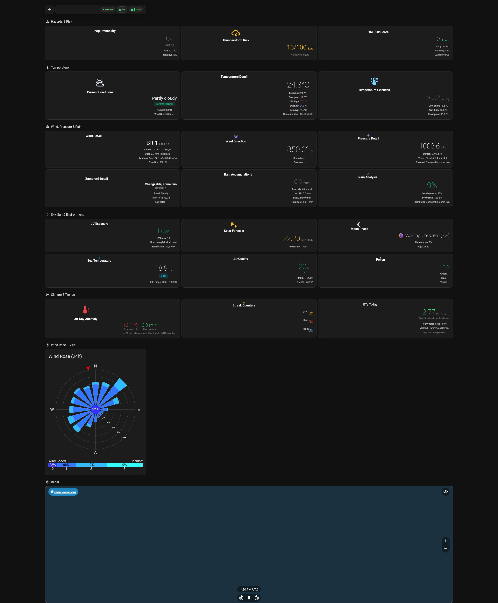
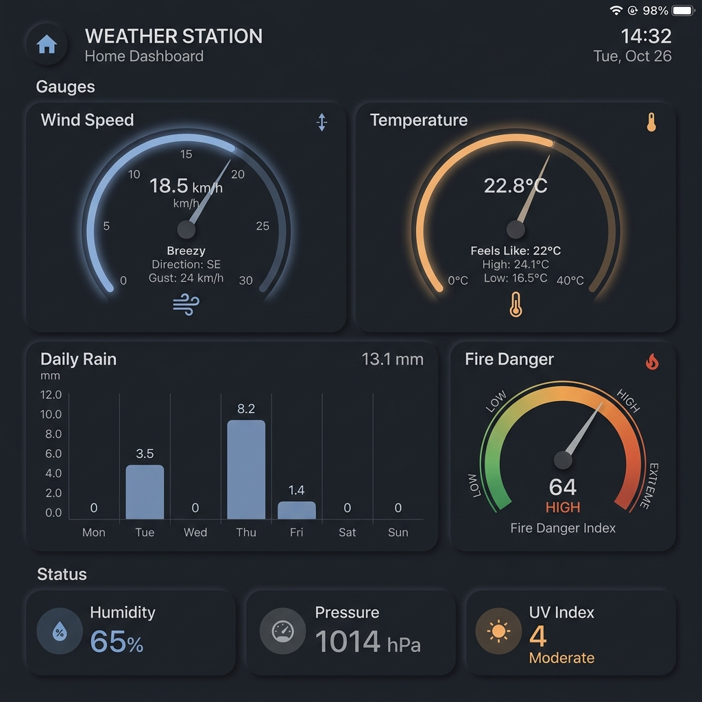

# Weather Station Core (`ws_core`)

[![HACS][hacs-badge]][hacs-url]
[![GitHub Release][release-badge]][release-url]
[![License][license-badge]][license-url]
[![Validate][validate-badge]][validate-url]
[![Translations][translation-badge]][translation-url]

**Know the exact minute the rain starts - and what your weather station was trying to tell you.**

`ws_core` turns the plain temperature, wind, and rain sensors you already have in Home Assistant into a full weather intelligence system. Its headline trick, when you enable Precipitation Nowcast, is watching *your own* rain gauge and correcting the forecast against it, so you get a live countdown to the minute rain begins.

> ### 🌧️ `sensor.ws_minutes_until_rain` → **7 min**

The **50+ core sensors run entirely on your machine**, computed from your own station data. No cloud, no API keys, nothing leaves your network. Optional extras (precipitation nowcast, air quality, forecast blending) add cloud enrichment only when *you* switch them on.

---

## 🚀 Try this one thing first

**Never get caught in the rain.** Point `ws_core` at your rain gauge, enable **Precipitation Nowcast** during setup (or later under **Configure → Features**), then watch `sensor.ws_minutes_until_rain` and have Home Assistant announce before the first drop. For simpler rain-rate or probability alerts, the [Rain Start Warning blueprint](blueprints/automation/ws_core/rain_start.yaml) sets up notifications in under a minute.

Once you are hooked, here is the rest:

* **Stop the sprinklers precisely.** Calculates real Evapotranspiration (ET0) so your smart irrigation knows exactly how much water the lawn actually needs.
* **Forecast with the internet off.** The offline Zambretti forecast predicts the next 12 hours from your local barometric pressure trend alone.
* **Automate your home around the weather.** 10 ready-to-use blueprints: TTS rain alerts, freeze warnings, irrigation skips, lightning safety, and high-wind awning retraction.
* **...and 170+ derived sensors in total** covering comfort, fire danger, solar, soil, and data quality once you enable the optional feature packs (see the [nerd section](#-advanced-features-the-nerd-section)).

---

## 📡 Does it work with my station?

**If your station is in Home Assistant, it works with `ws_core`.**

Works well with:

| Station / source | How `ws_core` uses it |
|---|---|
| Ecowitt / Ambient Weather | GW-series, WS90, WH57 lightning, rain, wind, solar, UV and indoor sensors already exposed in HA |
| WeatherFlow Tempest | Temperature, humidity, pressure, wind, rain, UV, illuminance and lightning entities |
| Davis Instruments | WeatherLink entities for classic PWS measurements and Davis comfort indices |
| Netatmo | Outdoor module plus optional rain and wind modules |
| MQTT / REST / template-backed sensors | Any standard HA sensor entities with temperature, humidity, pressure, wind and rain |

All you need are standard sensors like temperature, humidity, pressure, wind, and cumulative rain. The [Hardware Mapping Guide](docs/hardware_mapping.md) shows the usual entity patterns.

---

## ⚡ The 60-Second Quickstart

### Install via HACS (Recommended)

1. Open **HACS** in your Home Assistant sidebar.
2. Go to **Integrations** → ⋮ → **Custom repositories**.
3. Add `https://github.com/kmich/ha_ws_core` as an **Integration**.
4. Search for "Weather Station Core", install, and restart Home Assistant.

### Configure

Go to **Settings → Devices & Services → Add Integration** and search for "Weather Station Core". The setup wizard asks you to map 7 basic sensors:

* Temperature, Humidity, Absolute Pressure, Wind Speed, Wind Gust, Wind Direction, Rain Total

That's it! After the wizard completes, 50+ derived sensors appear automatically. Enable additional features like fire danger or nowcasting via the **Configure** button on the integration.

Not sure what to automate first? Start with the [Use Cases](docs/use_cases.md): rain alerts, irrigation skips, awning protection, frost warnings, and air-quality actions.

---

## 📊 The "Wow" Dashboards

`ws_core` comes with drop-in, premium Lovelace dashboards for your data.

| Mobile View | Desktop View |
|---|---|
|  |  |

Check out the `dashboards/` directory for the YAML code. We provide:
* A `vanilla` dashboard using only native HA cards.
* An `enhanced` dashboard using popular custom cards (`mini-graph-card`, `mushroom`).
* Ready-to-use gauge presets with sensible severity color bands.

---

## 🤖 Top Automations

Don't reinvent the wheel. We've included import-ready blueprints to automate your home based on your local weather:

* [**Rain Start Warning:**](blueprints/automation/ws_core/rain_start.yaml) Announce over TTS or send a push notification when rain is expected in the next few minutes.
* [**Freeze Warning:**](blueprints/automation/ws_core/freeze_alert.yaml) Trigger actions when the temperature drops below freezing.
* [**High Wind Gusts:**](blueprints/automation/ws_core/high_wind.yaml) Automatically retract your awnings or close the blinds when a high gust is recorded.
* [**Heat Stress / UTCI:**](blueprints/automation/ws_core/heat_stress.yaml) Notify when outdoor conditions become dangerous for work or exercise.
* [**Poor Air Quality:**](blueprints/automation/ws_core/poor_aqi.yaml) Close the windows and turn on the air purifiers when PM2.5 spikes.

---

## 🔬 Advanced Features (The "Nerd" Section)

Behind the scenes, `ws_core` implements rigorous meteorological and scientific algorithms to derive the most accurate insights from your station's data:

* **UTCI & WBGT:** The gold-standard heat-stress indices used by the WHO.
* **Three Fire Danger Systems:** Canadian FWI, Australian McArthur FFDI, and US Fosberg FFWI.
* **Stull Wet Bulb & Buck Frost Point:** Precise derivations with ice-constant handling.
* **Nowcast Ground-Truth Blending:** Combines Open-Meteo 15-minute grids with your live rain gauge data (70% local / 30% NWP) for the best short-term prediction.
* **Network Uploads:** Syncs to 8 networks simultaneously (WUnderground, Weathercloud, PWSWeather, WOW, AWEKAS, CWOP, OWM, Windy).
* **Adaptive Rain Probability:** Learns over a rolling 90-day window whether the local heuristics or the NWP forecasts have been more accurate.
* **Adaptive Sensor Calibration (opt-in):** Learns a slow bias estimate against the same regional reference point used for QC, and nudges the calibration offsets by a small, bounded amount once confident - so a consistently-off sensor self-corrects without you tracking down a reference station.
* **Historical Climate Normals (opt-in):** One Open-Meteo archive request builds a ~10-year, day-of-year table of typical highs/lows/rainfall for your location, so `sensor.ws_temp_anomaly_normal` can tell you today is warmer or colder than *this date normally is here* - not just warmer than your station's own recent average.
* **Snow (opt-in):** No station-agnostic snow gauge exists, so this estimates precipitation phase (rain/sleet/snow) from wet-bulb temperature and snow accumulation from your existing rain rate via a temperature-dependent snow-to-liquid ratio - heuristic, not a measurement, but a genuine gap most PWS integrations leave entirely unaddressed.
* **Localized UI & Sensors:** The setup wizard (including the hemisphere and climate-region pickers) and the human-readable sensors (conditions summary, alert message, frost risk) follow your Home Assistant language, with English, French, German, Spanish, Italian, Dutch, Polish, and Portuguese built in.

For the math, citations, and formulas behind these features, read the [**Scientific Documentation**](docs/science.md).

---

## 🤔 Why not just use template sensors?

You can absolutely hand-roll a heat-index template or install Thermal Comfort. The difference is scope and correctness:

| | A few template sensors | Thermal Comfort | **`ws_core`** |
|---|---|---|---|
| Comfort indices (heat index, wind chill, dew point) | Manual | ✅ | ✅ |
| Rain-start countdown from your own gauge | ❌ | ❌ | ✅ |
| Evapotranspiration (ET0) for irrigation | ❌ | ❌ | ✅ |
| Offline pressure-trend forecast | ❌ | ❌ | ✅ |
| Fire danger, UTCI/WBGT, frost point | ❌ | ❌ | ✅ |
| Ready-made automation blueprints | ❌ | ❌ | ✅ (10) |
| Runs fully local | ✅ | ✅ | ✅ (core) |

Already on Thermal Comfort? There is a [step-by-step migration guide](docs/migrating_from_thermal_comfort.md) that keeps your history.

---

## 🔒 Data & Privacy

`ws_core` is local-first. All core derived sensors are computed on your machine from
your own station data and never leave your network. Every feature that sends data to a
third party is **opt-in and disabled by default**, so nothing is transmitted until you
turn it on in **Configure → Features**.

When you enable them, the following optional features contact external services:

| Feature | Destination | Data sent |
|---|---|---|
| Forecast (Open-Meteo, Met.no, NWS, OWM, Pirate Weather, Météo France, HA entity) | The selected provider | Your coordinates |
| Precipitation nowcast, air quality, pollen, sea temperature, solar forecast | Open-Meteo / forecast.solar | Your coordinates |
| French Vigilance / Vigicrues | Météo-France public APIs | Your department / nearest station |
| Network uploads (WUnderground, Weathercloud, PWSWeather, WOW, AWEKAS, CWOP, OWM, Windy) | Each network you enable | Your live observations and that network's credentials |
| MQTT republishing | Your own MQTT broker | Derived sensor values |

API keys and passwords you enter are stored in the Home Assistant config entry. The
diagnostics export **redacts** all credentials and coordinates, so it is safe to attach
to a bug report.

---

## ❓ FAQ & Troubleshooting

* **Why are my entities unavailable?**
  Ensure your source sensors are online. If a required sensor (like temperature) is unavailable, dependent derived metrics will gracefully become `unavailable` until the source recovers.
* **Which sensors do I select during setup?**
  If Auto-Discovery didn't find your station, read our [Hardware Mapping Guide](docs/hardware_mapping.md) for exactly which Ecowitt, Tempest, or Netatmo entities to select.
* **How do I migrate from the Thermal Comfort integration?**
  We have a dedicated [migration guide](docs/migrating_from_thermal_comfort.md) with step-by-step instructions.
* **Do I need an API Key?**
  No. All core features run completely offline locally. Optional features like Air Quality or Nowcast use free APIs that require no registration.
* **Which fire-danger number should I trust?**
  Use the one calibrated for your region: **FFDI** (`sensor.ws_ffdi`) in Australia and New Zealand, **FWI** (`sensor.ws_fwi`, Canadian system) elsewhere, and **FFWI** (`sensor.ws_ffwi`) as a US/global cross-check. `sensor.ws_fire_risk_score` is a simplified 1-10 display value. None of these is an official warning - always defer to your local fire authority.
* **Which ET0 should I use for irrigation?**
  If you have mapped a solar-radiation sensor, prefer `sensor.ws_et0_penman_monteith` (FAO-56 Penman-Monteith, the reference method). Without solar radiation, use `sensor.ws_et0_daily` (Hargreaves-Samani, ±15-20%).
* **How do I uninstall?**
  Go to **Settings → Devices & Services → Weather Station Core → ⋮ → Delete**. This removes the integration, its device, and all derived entities and their history. To remove the code as well, delete the repository from **HACS → Integrations**. Any dashboards or blueprints you imported are independent and can be removed separately.

---

[hacs-badge]: https://img.shields.io/badge/HACS-Custom-orange.svg?style=for-the-badge
[hacs-url]: https://github.com/hacs/integration
[release-badge]: https://img.shields.io/github/v/release/kmich/ha_ws_core?style=for-the-badge
[release-url]: https://github.com/kmich/ha_ws_core/releases
[license-badge]: https://img.shields.io/github/license/kmich/ha_ws_core?style=for-the-badge
[license-url]: https://github.com/kmich/ha_ws_core/blob/main/LICENSE
[validate-badge]: https://img.shields.io/github/actions/workflow/status/kmich/ha_ws_core/validate.yml?branch=main&label=validate&style=for-the-badge
[validate-url]: https://github.com/kmich/ha_ws_core/actions/workflows/validate.yml
[translation-badge]: https://img.shields.io/badge/Translations-8-blue?style=for-the-badge
[translation-url]: https://github.com/kmich/ha_ws_core/tree/main/custom_components/ws_core/translations
