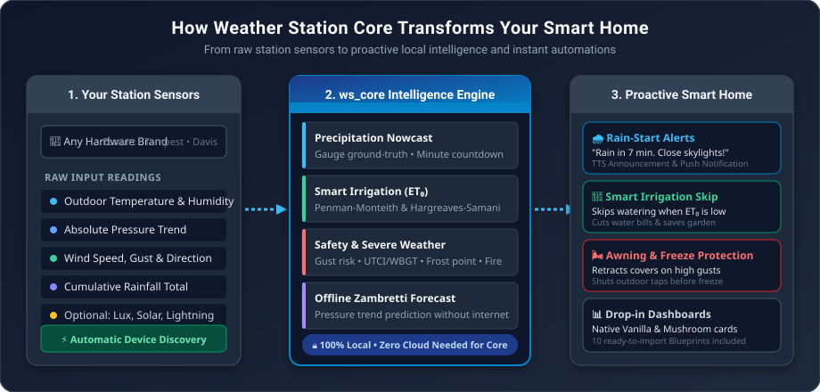
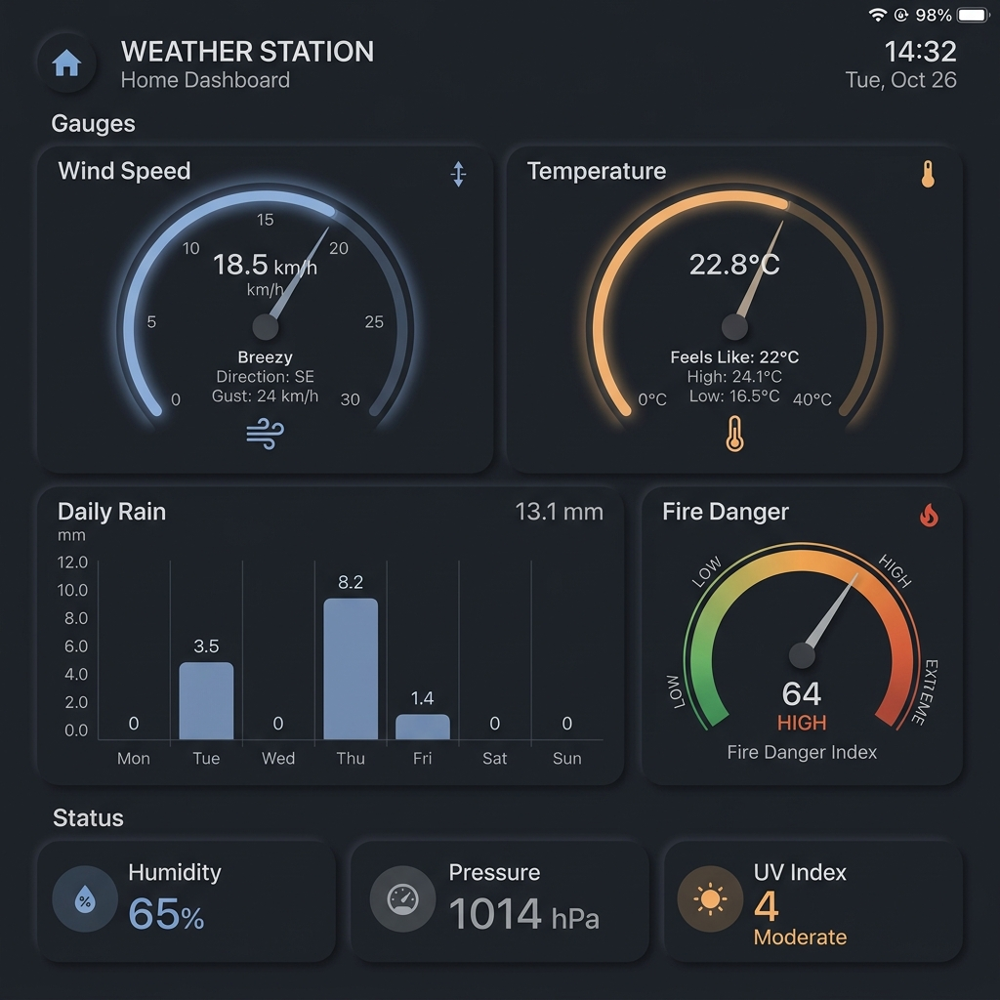
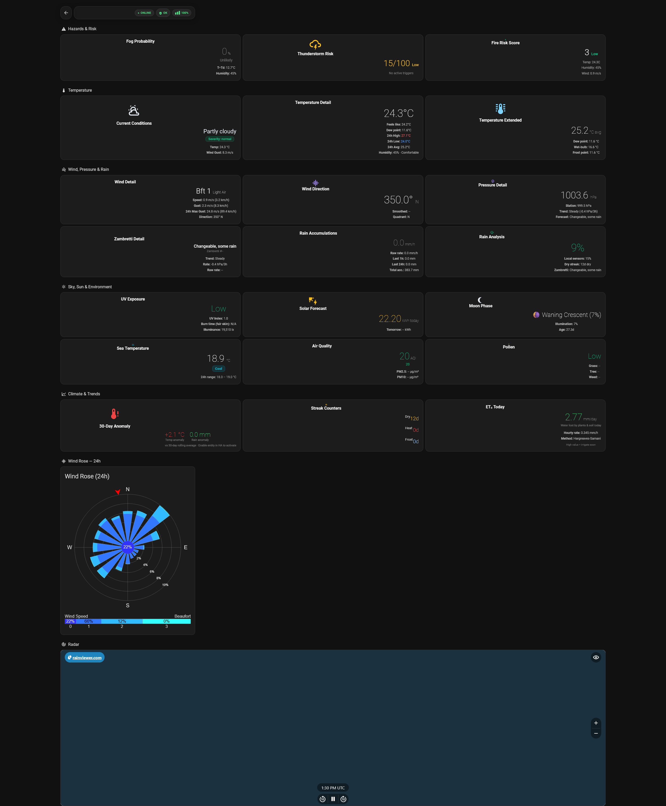

# Weather Station Core (`ws_core`)

[![HACS][hacs-badge]][hacs-url]
[![GitHub Release][release-badge]][release-url]
[![License][license-badge]][license-url]
[![Validate][validate-badge]][validate-url]
[![Translations][translation-badge]][translation-url]

**Turn your weather station into proactive smart home automations — not just numbers on a dashboard.**

`ws_core` takes the ordinary temperature, wind, and rain sensors you already have in Home Assistant and turns them into a local weather intelligence engine. It watches *your own* rain gauge to predict the exact minute rain begins, calculates true garden evapotranspiration (ET₀) to stop overwatering, protects awnings from wind gusts, and predicts storms offline — **running 100% locally on your machine with zero cloud dependencies.**

> ### 🌧️ `sensor.ws_minutes_until_rain` → **7 min**
> *Precipitation nowcasting uses your own gauge as ground truth to give you a live countdown before the first drop falls.*

---

---

## ⚡ Why Install `ws_core`? (Before vs. After)

Most weather stations in Home Assistant just show raw numbers. `ws_core` transforms those readings into automatic protection for your home and garden:

| Your Weather Station Today | With Weather Station Core |
|---|---|
| Displays `21°C` and `15 km/h wind` on a card | **Auto-retracts awnings and blinds** when dangerous wind gusts hit |
| Sprinklers run on a dumb timer regardless of weather | **Skips watering** using locally calculated evapotranspiration (ET₀) and rainfall |
| Cloud weather app says *"40% chance of rain"* | **TTS voice alert:** *"🌧️ Rain starting in 7 minutes at your house — close the skylight"* |
| Internet drops = weather forecasts vanish | **100% offline Zambretti forecast** predicts the next 12 hours from local pressure trends |
| Raw sensors without context | **50+ core derived insights:** frost point, heat stress (UTCI/WBGT), fire risk, wet-bulb |

---

## 🌟 The 4 Core Benefit Pillars

### 1. 🌧️ Smart Rain Defense: Never Get Soaked
Know before the first drop hits. Enable **Precipitation Nowcast** to combine local radar models with your physical rain gauge. 
* **Live countdown:** `sensor.ws_minutes_until_rain` gives you minutes to close skylights, pull in outdoor cushions, or walk the dog.
* **Pre-rain notifications:** Alert your family via phone or smart speaker before rain starts.
* **Rain dry-time:** `sensor.ws_minutes_until_dry` lets you know when outdoor surfaces will dry after a shower.

### 2. 🌱 Intelligent Garden & Irrigation: Zero Wasted Water
Stop running sprinklers after a downpour. `ws_core` implements scientific evapotranspiration formulas so your irrigation knows what the soil actually needs.
* **Reference ET₀ (FAO-56 Penman-Monteith & Hargreaves-Samani):** Calculates daily water loss based on solar radiation, temperature, humidity, and wind.
* **Smart Irrigation bridge:** Seamlessly feeds ET₀ data into the popular `HAsmartirrigation` integration.
* **One-click rain skip:** Automatically cancel tomorrow's watering if today's rainfall exceeded lawn requirements.

### 3. 🛡️ Home & Property Protection: Defend Against Extremes
Safeguard your home against high winds, freezing temperatures, and dangerous heat:
* **High-wind awning & blind protection:** Instant alerts and automatic retraction commands when wind gusts exceed structural limits.
* **Freeze & frost warnings:** Accurate Buck (1981) frost-point derivation alerts you to protect sensitive plants and outdoor water pipes.
* **Heat stress monitoring (UTCI & WBGT):** Gold-standard comfort indices used by the WHO to warn when outdoor work or sports become hazardous.
* **Fire weather indices:** Complete implementations of Canadian FWI, Australian McArthur FFDI, and US Fosberg FFWI.

### 4. 🔌 100% Local-First Resilience: Privacy & Offline Reliability
Your smart home shouldn't stop working when your internet connection goes down.
* **Offline Zambretti forecasting:** A mathematical barometric forecast calibrated to your hemisphere and climate region — 100% local, no cloud, no API keys.
* **Privacy by design:** All 50+ core derived sensors are computed directly inside Home Assistant on your local hardware.
* **Zero telemetry:** No coordinates, sensor readings, or personal data ever leave your network unless you explicitly enable an optional external service.

---

## 📡 Hardware Compatibility

**If your weather station is already in Home Assistant, it works with `ws_core`.**

| Station Brand | Supported Models / Integrations | What `ws_core` Uses |
|---|---|---|
| **Ecowitt / Ambient Weather** | GW-series, WS90, Wittboy, WH57 lightning, soil, and rain gauges | Outdoor temp, humidity, absolute pressure, wind, rain, lux/solar, lightning |
| **WeatherFlow Tempest** | Tempest Home Assistant integration & local UDP / MQTT | Air temp, station pressure, wind speed/gust, rain, UV, illuminance |
| **Davis Instruments** | WeatherLink IP, Vantage Pro2, Vantage Vue | Classic PWS measurements, rain year, bar absolute |
| **Netatmo** | Netatmo Smart Weather Station (Outdoor + Rain + Wind) | Outdoor module readings, rain gauge total, anemometer wind |
| **Shelly / ESPHome / DIY** | Any custom sensor entity with standard device classes | Temperature, humidity, pressure, wind, cumulative rain total |

👉 *Need help mapping your entities? Check out our [Hardware Mapping Guide](docs/hardware_mapping.md).*

---

## 🤖 1-Click Automation Blueprints

Don't spend hours writing YAML. We provide ready-to-import blueprints with sensible defaults:

| Blueprint | What It Does | One-Click Install |
|---|---|---|
| **Rain Start Warning** | Announce via TTS or mobile notification when rain is imminent |  |
| **Irrigation Rain Skip** | Automatically skip watering when rainfall or ET₀ indicates sufficient moisture |  |
| **High Wind Protection** | Automatically retract awnings and blinds when severe wind gusts are detected |  |
| **Freeze Warning** | Alert when temperature drops near freezing and turn off exposed irrigation valves |  |
| **Heat Stress Alert** | Notify when apparent temperature (UTCI) reaches dangerous levels for outdoor activity |  |

👉 *Browse all 10 blueprints and configuration options in the [Blueprint Documentation](docs/blueprints.md).*

---

## ⚡ 3-Minute Quickstart

### Step 1: Install via HACS

1. Open **HACS** in your Home Assistant sidebar.
2. Click **Integrations** → ⋮ (top right) → **Custom repositories**.
3. Paste `https://github.com/kmich/ha_ws_core`, choose category **Integration**, and click **Add**.
4. Search for **"Weather Station Core"**, download, and restart Home Assistant.

### Step 2: Add Integration & Auto-Discover

1. In Home Assistant, go to **Settings → Devices & Services → Add Integration**.
2. Search for **"Weather Station Core"**.
3. **Auto-Discovery** will automatically identify and suggest matching sensor entities from your station.
4. Review the mapped entities, click **Submit**, and you're done!

50+ core sensors appear instantly. You can enable optional enrichments (air quality, nowcast, multi-network upload) at any time under **Configure → Features**.

---

## 📊 Drop-in Lovelace Dashboards

`ws_core` includes pre-built, responsive Lovelace dashboards tailored for your weather data:

| Mobile View | Desktop View |
|---|---|
|  |  |

In the `dashboards/` directory, you'll find:
* **Vanilla Dashboard:** Works immediately with 100% native Home Assistant cards (zero custom card dependencies).
* **Enhanced Dashboard:** Uses popular cards (`mushroom`, `mini-graph-card`) with custom severity color bands and gauges.

---

## 🔬 Meteorological Precision & Science

Behind the friendly sensors, `ws_core` runs rigorous, peer-reviewed meteorological algorithms:

* **UTCI (Universal Thermal Climate Index):** Complete Bröde (2012) polynomial modeling human heat balance across radiation, humidity, and wind.
* **Wet Bulb & Frost Point:** Stull (2011) and Buck (1981) formulas with ice-constant handling.
* **Nowcast Ground-Truth Blending:** Merges high-resolution NWP radar grids with your local physical rain gauge (70% local / 30% forecast) for pinpoint start times.
* **Adaptive Rain Probability:** Learns over a rolling 90-day window via Brier-score evaluation to continuously improve accuracy.
* **Multi-Network Weather Sync:** Broadcasts your station observations simultaneously to 8 global networks (WUnderground, Weathercloud, PWSWeather, WOW, AWEKAS, CWOP, OWM, Windy).
* **Full Translation Parity:** Available in English, French, German, Spanish, Italian, Dutch, Polish, and Portuguese.

For complete equations, source citations, and mathematical references, see the [**Scientific Documentation**](docs/science.md).

---

## 🔒 Data & Privacy Disclosure

`ws_core` is strictly local-first. All core sensors are derived locally. Optional third-party features are **disabled by default** and only contact external services when explicitly enabled:

| Feature | Destination | Data Sent | When Used |
|---|---|---|---|
| **Core Derived Sensors** | *Local Machine* | None (processed locally) | Always (Default) |
| **Precipitation Nowcast & AQI** | Open-Meteo API | Approximate Coordinates | Only if enabled |
| **French Vigilance** | Météo-France Public API | Department Code | Only if enabled |
| **PWS Network Uploads** | Selected Network (e.g. WU, WOW) | Station Readings & User Credentials | Only if enabled |
| **MQTT Discovery** | Local MQTT Broker | Derived Sensor Values | Only if enabled |

Diagnostics exports automatically **redact all credentials and coordinates** before download.

---

## ❓ Frequently Asked Questions

<b>Why not just write a few template sensors in YAML?</b>

Template sensors are great for simple math (e.g., Fahrenheit to Celsius), but they cannot easily compute complex meteorological models like Penman-Monteith ET₀, Bröde UTCI polynomials, or 90-day adaptive Brier scores. Template sensors also don't include blueprints, dashboards, diagnostics, or auto-discovery.

<b>Can I migrate from the Thermal Comfort integration?</b>

Yes! `ws_core` provides a drop-in replacement with identical or higher-precision comfort indices. Follow our step-by-step <a href="docs/migrating_from_thermal_comfort.md">Thermal Comfort Migration Guide</a> to preserve entity history.

<b>Do I need any API keys?</b>

No. The core integration and all 50+ base sensors require zero API keys and work completely offline. Optional extras like Open-Meteo precipitation nowcasting and air quality use free public APIs that also require no registration.

<b>What if some of my sensors are temporarily offline?</b>

`ws_core` handles sensor degradation gracefully. If your wind sensor goes offline, wind-dependent metrics will report <code>unavailable</code>, while independent metrics (like barometric pressure trends and temperature comfort) continue working seamlessly.

---

## 🤝 Community & Support

* 💬 **Discussions & Showcase:** Share your dashboards and station setups in [GitHub Discussions](https://github.com/kmich/ha_ws_core/discussions).
* 🐛 **Bug Reports & Feature Requests:** Open an issue on [GitHub Issues](https://github.com/kmich/ha_ws_core/issues).
* 📖 **Full Documentation:** Visit the [Weather Station Core Documentation](https://kmich.github.io/ha_ws_core/).

[hacs-badge]: https://img.shields.io/badge/HACS-Custom-orange.svg?style=for-the-badge
[hacs-url]: https://github.com/hacs/integration
[release-badge]: https://img.shields.io/github/v/release/kmich/ha_ws_core?style=for-the-badge
[release-url]: https://github.com/kmich/ha_ws_core/releases
[license-badge]: https://img.shields.io/github/license/kmich/ha_ws_core?style=for-the-badge
[license-url]: https://github.com/kmich/ha_ws_core/blob/main/LICENSE
[validate-badge]: https://img.shields.io/github/actions/workflow/status/kmich/ha_ws_core/validate.yml?branch=main&label=validate&style=for-the-badge
[validate-url]: https://github.com/kmich/ha_ws_core/actions/workflows/validate.yml
[translation-badge]: https://img.shields.io/badge/Translations-8-blue?style=for-the-badge
[translation-url]: https://github.com/kmich/ha_ws_core/tree/main/custom_components/ws_core/translations
